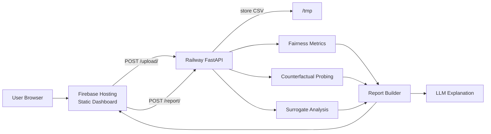
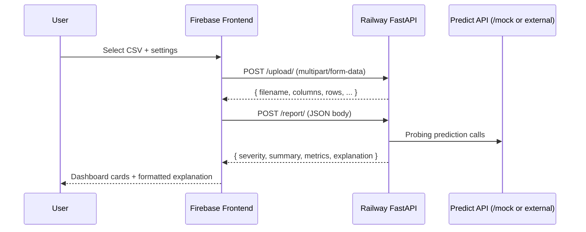

# audit

**audit** is an end-to-end bias auditing platform with a Firebase-hosted dashboard and a Railway-deployed FastAPI backend.  
It analyzes uploaded CSV data for fairness risk and returns severity, metrics, summary signals, and an LLM explanation.

---

## What this project does

1. Upload a dataset (`.csv`) from the web dashboard.
2. Store the file temporarily on backend (`/tmp`).
3. Run fairness analysis:
   - disparate impact
   - counterfactual probing against a prediction API
   - surrogate-model feature importance
4. Generate a bias report with severity + summary + metrics + explanation.

---

## Architecture



### Runtime request flow



---

## Tech stack

### Frontend
- Vanilla HTML/CSS/JavaScript (`frontend/`)
- Hosted on Firebase Hosting

### Backend
- FastAPI + Uvicorn (Python 3.11)
- pandas, numpy, scipy, scikit-learn, shap
- `python-multipart` for file uploads

### AI explanation
- Groq Chat Completions API (`llama-3.1-8b-instant`)
- Env var: `GROQ_API_KEY`

---

## Repository structure

```text
audit/
├── backend/
│   ├── main.py
│   ├── api/
│   │   ├── upload.py
│   │   ├── report.py
│   │   ├── mock_model.py
│   │   ├── scan.py
│   │   ├── audit.py
│   │   ├── probe.py
│   │   └── surrogate.py
│   ├── model_audit/
│   ├── data_layer/
│   ├── report/
│   └── utils/
├── frontend/
│   ├── index.html
│   ├── app.js
│   └── style.css
├── Dockerfile
├── firebase.json
├── requirements.txt
└── README.md
```

---

## API overview

### `GET /health`
Returns health status.

### `POST /upload/`
Accepts `multipart/form-data` with `file` (`UploadFile`), stores in `/tmp`, returns metadata and stored filename.

### `POST /report/`
Accepts JSON:

```json
{
  "filename": "stored_name.csv",
  "prediction": "prediction",
  "protected": "gender",
  "predict_url": "https://.../predict",
  "allow_local_predict_url": false
}
```

Returns:
- `severity`
- `summary`
- `metrics`
- `explanation`

### `POST /mock/`
Simple mock predictor for local/demo probing.

---

## Local development

### 1) Backend

```bash
python -m venv .venv
# Windows (PowerShell)
.venv\Scripts\Activate.ps1
pip install -r requirements.txt
uvicorn backend.main:app --reload --host 0.0.0.0 --port 8080
```

Backend URL: `http://localhost:8080`

### 2) Frontend (static)

Serve `frontend/` with any static server, for example:

```bash
cd frontend
python -m http.server 5500
```

Frontend URL: `http://localhost:5500`

> Update `API_BASE_URL` in `frontend/app.js` if testing against local backend.

---

## Deployment

### Railway (backend)
- Uses `Dockerfile` with `uvicorn backend.main:app --port 8080`.
- File uploads are stored in `/tmp` (ephemeral runtime storage).

### Firebase Hosting (frontend)
- `firebase.json` serves the `frontend/` directory.
- Frontend should call Railway API over **HTTPS** only.

---

## Severity mapping (current)

| Signal | Low | Moderate | High | Critical |
|---|---:|---:|---:|---:|
| Disparate Impact | `>= 0.9` | `>= 0.8` | `>= 0.6` | `< 0.6` |
| Counterfactual Diff | `< 0.05` | `< 0.15` | `< 0.3` | `>= 0.3` |

---

## Environment variables

| Variable | Required | Purpose |
|---|---|---|
| `GROQ_API_KEY` | Optional | Enables LLM-generated explanation text |
| `AUDIT_ALLOW_PRIVATE_PREDICT_URLS` | Optional | Allow private/localhost predict URLs when set to `1` |

---

## Troubleshooting

- **Mixed content error (`https` page calling `http`)**  
  Use HTTPS API base URL and call canonical routes (`/upload/`, `/report/`) to avoid redirect issues.

- **`Uploaded file not found in /tmp`**  
  The report request must use the exact `filename` returned by `/upload/`.

- **Invalid CSV / missing columns**  
  Ensure the selected `prediction` and `protected` columns exist in the uploaded CSV.

---

## License

This repository is licensed under the terms in `LICENSE`.
